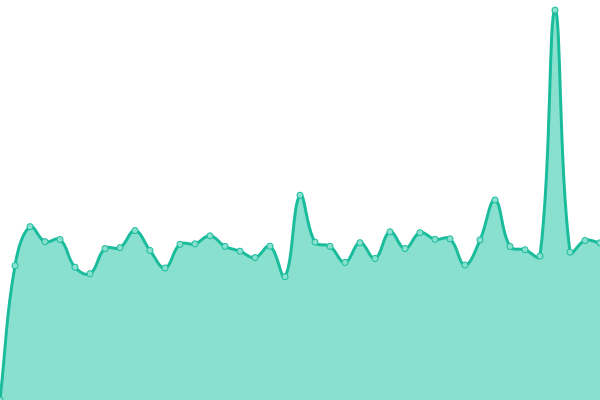

# [📈 Live Status](https://rajuprasad-dev.github.io/upptime-monitor): <!--live status--> **🟧 Partial outage**

This repository contains the open-source uptime monitor and status page for [Raju Prasad](https://rajuprasad.com/), powered by [Upptime](https://github.com/upptime/upptime).

With [Upptime](https://upptime.js.org), you can get your own unlimited and free uptime monitor and status page, powered entirely by a GitHub repository. We use [Issues](https://github.com/rajuprasad-dev/upptime-monitor/issues) as incident reports, [Actions](https://github.com/rajuprasad-dev/upptime-monitor/actions) as uptime monitors, and [Pages](https://rajuprasad-dev.github.io/upptime-monitor) for the status page.

<!--start: status pages-->
<!-- This summary is generated by Upptime (https://github.com/upptime/upptime) -->
<!-- Do not edit this manually, your changes will be overwritten -->
<!-- prettier-ignore -->
| URL | Status | History | Response Time | Uptime |
| --- | ------ | ------- | ------------- | ------ |
|  [Raju Prasad](https://www.rajuprasad.com) | 🟩 Up | [raju-prasad.yml](https://github.com/rajuprasad-dev/upptime-monitor/commits/HEAD/history/raju-prasad.yml) | 

 1012ms
     
 | 

<a href="https://rajuprasad-dev.github.io/upptime-monitor/history/raju-prasad">93.40%</a>
    

|  [Mumbai Moments](https://www.mumbaimoments.com) | 🟩 Up | [mumbai-moments.yml](https://github.com/rajuprasad-dev/upptime-monitor/commits/HEAD/history/mumbai-moments.yml) | 

 4748ms
     
 | 

<a href="https://rajuprasad-dev.github.io/upptime-monitor/history/mumbai-moments">53.56%</a>
    

|  [Epic Mumbai Tours](https://www.epicmumbaitours.com) | 🟩 Up | [epic-mumbai-tours.yml](https://github.com/rajuprasad-dev/upptime-monitor/commits/HEAD/history/epic-mumbai-tours.yml) | 

 4335ms
     
 | 

<a href="https://rajuprasad-dev.github.io/upptime-monitor/history/epic-mumbai-tours">53.09%</a>
    

|  [Intorspace](https://www.intorspace.com) | 🟥 Down | [intorspace.yml](https://github.com/rajuprasad-dev/upptime-monitor/commits/HEAD/history/intorspace.yml) | 

 0ms
     
 | 

<a href="https://rajuprasad-dev.github.io/upptime-monitor/history/intorspace">0.00%</a>
    

<!--end: status pages-->

[**Visit our status website →**](https://rajuprasad-dev.github.io/upptime-monitor)

## 📄 License

- Powered by: [Upptime](https://github.com/upptime/upptime)
- Code: [MIT](./LICENSE) © [Anand Chowdhary](https://anandchowdhary.com), supported by [Pabio](https://pabio.com)
- Data in the `./history` directory: [Open Database License](https://opendatacommons.org/licenses/odbl/1-0/)
